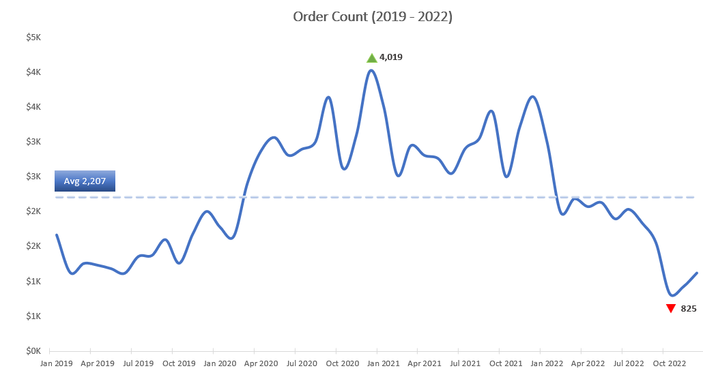
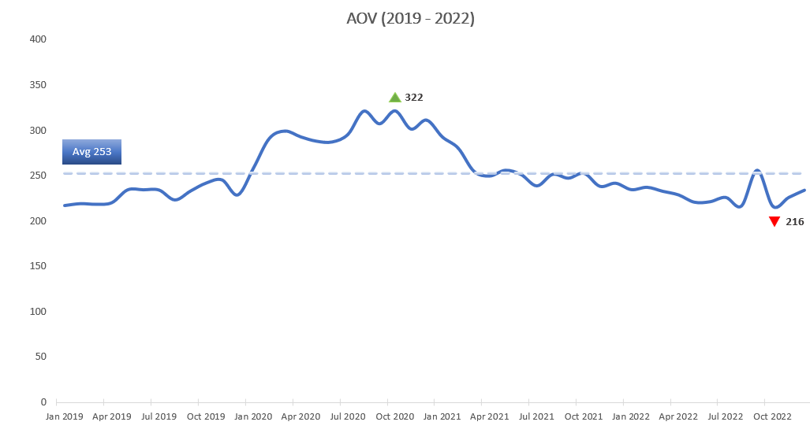

# Elist Analysis
Sales trend analysis for e-commerce company

# Overview
## ERD

# Deep-dive Insights
## Sales Trend

  
  

### Revenue
Monthly sales generally increased from 2019 through 2020, peaking at approximately **$1.25M in December 2020**. Sales then trended downward through 2021 and 2022, despite some month-to-month fluctuations. The lowest monthly sales occurred in **October 2022 at approximately $178K**, followed by a slight recovery to $262K in December 2022. 

On a yearly basis, sales increased sharply from **$3.9M in 2019, the lowest annual sales** during the period, to a **peak of $10.2M in 2020**. Sales then declined slightly to $9.1M in 2021, followed by a larger decrease to approximately $5.0M in 2022.

### Order Count
Monthly order volume followed a similar pattern to sales. Orders **peaked at approximately 4,019 in December 2020**, then declined to **825 in October 2022, the lowest monthly order count between 2019 and 2022**, before recovering slightly to approximately 1,120 in December 2022.

### Average Order Value

AOV **ranged from approximately $216 to $322** between 2019 and 2022, with an overall **average of approximately $253**. 

In **December 2020**, when both sales and order volume **peaked at approximately $1.25M and 4,019 orders**, AOV was about **$311**. Overall, AOV remained relatively stable compared with the larger fluctuations in sales and order volume. This suggests that **changes in order volume were a major driver of monthly sales performance**, rather than large changes in customer spending per order.

### Seasonal Trends
**Peak Sales Months**: In 2019 and 2020, annual sales peaked in **December**, aligning with the holiday shopping season. In 2021 and 2022, however, the peak shifted to **January**, suggesting a change in the seasonal sales pattern toward the beginning of the year.

**Lowest Sales Months**: The lowest monthly sales occurred in **January/February** in 2019 and 2020, which may reflect a post-holiday slowdown. In 2021 and 2022, the lowest sales shifted to **October**, suggesting a potential slowdown before Black Friday and the holiday shopping season.

### Growth Rates

The **strongest sales growth** occurred around **November and December in three of the four years**, indicating sales momentum typically builds ahead of the December/January peak period. **The steepest month-over-month** declines generally occurred either after the holiday season or before the year-end shopping period, particularly around **February and October**. 

**2020** was an exception, with the **highest growth occurring in March**. This may reflect unusual purchasing behavior during the early COVID-19 periods.

Overall, the data suggests a recurring seasonal pattern of stronger growth approaching the holidays, followed by weaker sales afterward.

## Product Trends

The **top three selling products** from 2019 to 2022 were the **27-inch 4K Gaming Monitor, Apple AirPods Headphones, and MacBook Air Laptop**. Together, these products accounted for approximately **80% of total sales**, indicating that revenue was highly concentrated among a small number of products.

The **27-inch 4K Gaming Monitor** remained the **top-selling** product throughout the period. Sales **peaked at approximately $3.3M, representing about 37% of total sales in 2021** and an average of approximately **36% of annual sales from 2019 to 2022**. Monitor sales increased by approximately 114% from 2019 to 2020 and another 8% in 2021, before declining by approximately 42% in 2022. Despite the decline, it remained the leading revenue-generating product.

**The MacBook Air Laptop** showed particularly strong growth in **2020, increasing by approximately 384%**, followed by slower growth in 2021 and a **55% decline in 2022**. A similar pattern was observed for the **ThinkPad Laptop**.

**Overall product sales weakened significantly in 2022**, with total sales **declining by approximately 46% from 2021**. **Bose SoundSport Headphones** experienced the **largest decline**, with sales decreasing by approximately 91% from 2021 to 2022. Since its introduction in 2020, it consistently recorded **the lowest sales revenue and order count among all products in 2020 - 2022**.

--------------
Apple iphone making 1% of avg total sales from 2019 - 2022
which Products sell best in which month

## Geography Trends

## Loyalty Program

## Refund Rates
